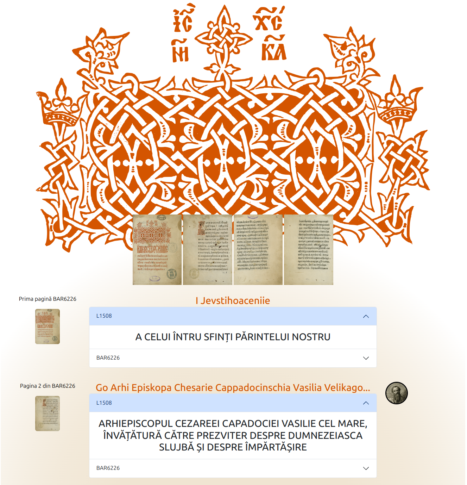

# Liturghierul-Macarie-1508-editions

Acest demers și-a propus inițierea efortului de realizare a unor ediții digitale ale primei cărți tipărite din spațiul românesc medieval. Codarea a împrumutat elemente care sunt folosite în mod obișnuit la manuscrise, dar și elemente care sunt folosite pentru codarea primelor tipărituri. Tehnologia pentru codarea tipăriturii este XML urmând prescripțiile și rețetele Text Encoding Initiative. Scopul final este stimularea cercetării în această sferă a tehnologiilor Umanioarelor Digitale pentru a creea un cadru multidisciplinar de lucru și schimb de experiență.
Practica a indicat faptul că TEI este un cadru flexibil, exemplele disponibile fiind ușor de accesat și consultat. Rezultatele se vor contura pe două axe. Prima este legată de activitatea de codate a textelor cu toată atenția necesară detaliilor care surprind particularitatea textelor, formatărilor, detaliilor specifice unui exemplar, ș.a.m.d.
Liturghierul lui Macarie devine o primă parte a unui corpus pe care autorii își doresc să-l creeze cu scopul de a recontextualiza și valorifica într-o paradigmă nouă legată de adăugarea valorii suplimentare pe care textul structurat o aduce.

